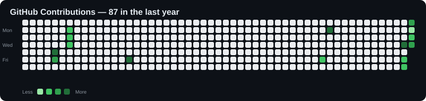

<div align="center">
  
</div>

<div align="center" style="margin: 20px 0; max-width: 100%;">
  
</div>

<div align="center" style="margin: 20px 0;">

  <a href="https://github.com/vikassinghz">
    
  </a>

  <a href="https://linkedin.com/in/vikassinghz">
    
  </a>

  <a href="mailto:work.baghel@gmail.com">
    
  </a>

</div>

<hr style="border-top: 3px solid #6D28D9; margin: 30px 0;">

## 📊 Live Performance Analytics

<!-- GitHub Stats -->
<div align="center">
  
</div>

<!-- Top Languages -->
<div align="center" style="margin-top: 20px;">
  
</div>

<!-- GitHub Streak -->
<div align="center" style="margin-top: 20px;">
  
</div>

<!-- Real GitHub Contribution Calendar -->
<div align="center" style="margin-top: 25px;">
  
</div>

<!-- Profile Views -->
<div align="center" style="margin-top: 20px;">
  
</div>

<hr style="border-top: 3px solid #6D28D9; margin: 30px 0;">

---

## 👨‍💻 About Me

Hi, I'm **Vikas Singh Baghel**, an **AI & Full-Stack Developer** interested in building intelligent, useful and scalable software products.

- 🎓 B.Tech in Information Technology — **Artificial Intelligence & Robotics**
- 🤖 Interested in **AI, LLMs, RAG & intelligent applications**
- 💻 Building with **React, Next.js, Node.js, Python & TypeScript**
- 🧠 Practicing **Data Structures & Algorithms**
- 📊 Exploring **Data Science & Machine Learning**
- 🚀 Interested in turning ideas into real-world products
- 🌱 Currently exploring **LLMs, RAG, AI Agents & AI systems**
- 🤝 Open to interesting projects and collaborations

---

## 🛠️ Tech Stack

### 💻 Languages

<p>

</p>

<p>

</p>

### 🌐 Web Development

<p>

</p>

### 🗄️ Databases

<p>

</p>

### 🤖 AI / Machine Learning

<p>

</p>

<p>


</p>

### ⚙️ Tools

<p>

</p>

---

## 🚀 Featured Projects

<table>
<tr>

<td width="50%" valign="top">

### 🧠 Kalam AI

AI-powered writing assistant for creating and improving content.

**Features**

- ✍️ Content Creation
- 🔄 Rewriting & Paraphrasing
- 📧 Email Composition
- 🔎 Research Assistance
- 📱 Social Media Content

**Stack**

`React` `Vite` `TypeScript` `Groq` `Tailwind CSS`

<br>

<a href="https://github.com/vikassinghz/KALAM">

</a>

</td>

<td width="50%" valign="top">

### 📊 Enterprise Communication Tracker

Communication management and analytics platform.

**Features**

- 🏢 Company Management
- 📈 Communication Analytics
- 📅 Calendar View
- 📄 CSV & PDF Reports
- 🔔 Notifications
- 📱 Responsive UI

**Stack**

`React` `Tailwind` `Zustand` `Recharts` `Vite`

<br>

<a href="https://github.com/vikassinghz/Communication_Tracker_vikas">

</a>

</td>

</tr>

<tr>

<td width="50%" valign="top">

### 📰 ML News Detection

Machine-learning based project focused on detecting and classifying news content.

**Focus**

`Machine Learning` `NLP` `Data Processing`

<br>

<a href="https://github.com/vikassinghz/ML_News_Detection">

</a>

</td>

<td width="50%" valign="top">

### 🧩 Awesome CP Resources

Curated resources for competitive programming and DSA.

**Focus**

`DSA` `Algorithms` `Competitive Programming` `Problem Solving`

<br>

<a href="https://github.com/vikassinghz/awesome-cp-resources">

</a>

</td>

</tr>

<tr>

<td width="50%" valign="top">

### 🌐 Awesome Web Dev

Curated resources covering modern web development.

**Focus**

`Frontend` `Backend` `Web Development` `Developer Tools`

<br>

<a href="https://github.com/vikassinghz/awesome-web-dev">

</a>

</td>

<td width="50%" valign="top">

### 💻 LeetCode Grind

My ongoing journey of solving algorithmic problems and improving DSA skills.

**Focus**

`Data Structures` `Algorithms` `Problem Solving`

<br>

<a href="https://github.com/vikassinghz/LeetCodeGrind">

</a>

</td>

</tr>
</table>

---

## 💼 Experience

| Role | Organization | Focus |
|---|---|---|
| **Software Developer Intern** | INDVIBE INFOTECH | React · Tailwind · Zustand · Analytics |
| **Machine Learning Intern** | Vivada Tech | NLP · Prompt Engineering · LLM APIs |
| **Data Analyst Intern** | Mentorness | SQL · Power BI · Tableau |
| **Web Developer Intern** | Internpe | React · Tailwind · Responsive Web |
| **AI Trainer** | Outlier AI | AI Training · Dataset Curation |
| **Campus Ambassador** | Physics Wallah | Community · Outreach |

---

## 🏆 Achievements & Certifications

- 🥇 **Pre-Rashtrapati Award** — Bharat Scouts and Guides
- 🏅 **Rajya Puraskar** — Bharat Scouts and Guides
- ☁️ **Oracle Cloud Infrastructure 2025 — AI Foundations Associate**
- 📊 **Oracle Certified Data Science**
- 🎥 Built a YouTube channel with **7.5K+ subscribers**

---

## 🔭 Currently Exploring

<div align="center">

`LLMs` → `RAG` → `AI Agents` → `LangGraph` → `Vector Databases` → `Production AI`

<br><br>

**DSA** → **System Design** → **Backend Engineering** → **Cloud** → **Software Architecture**

</div>

---

## 📈 My Development Journey

```text
AI & Robotics
      │
      ├── Machine Learning
      │
      ├── Data Science
      │
      ├── Web Development
      │
      ├── Full-Stack Engineering
      │
      └── Generative AI
              │
              ├── LLMs
              ├── RAG
              ├── AI Agents
              └── Intelligent Applications
```
## 🤝 Let's Connect
<div align="center"> <a href="https://github.com/vikassinghz">  </a> <a href="https://www.linkedin.com/in/vikassinghz/">  </a> <a href="mailto:work.baghel@gmail.com">  </a> </div> <br> <div align="center">
💡 Code Today. Innovate Tomorrow.
<br>


</div> 
